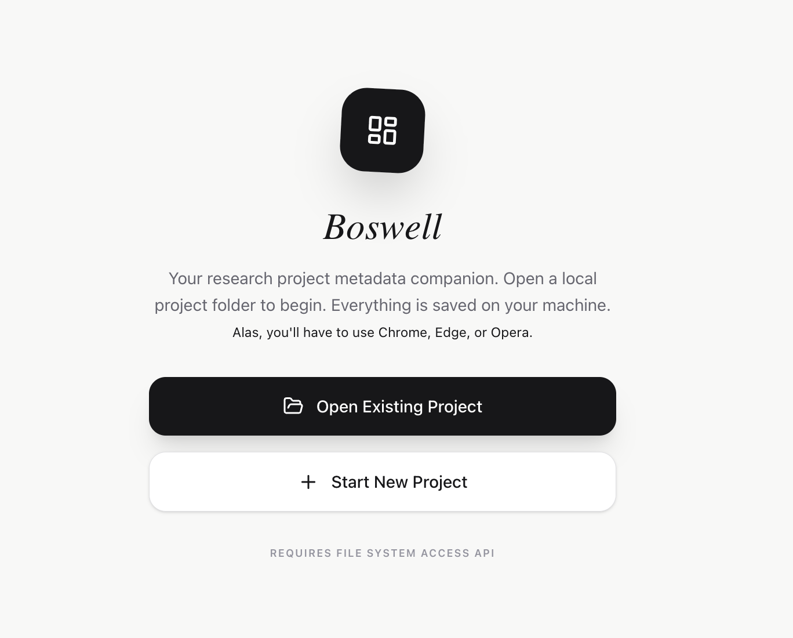
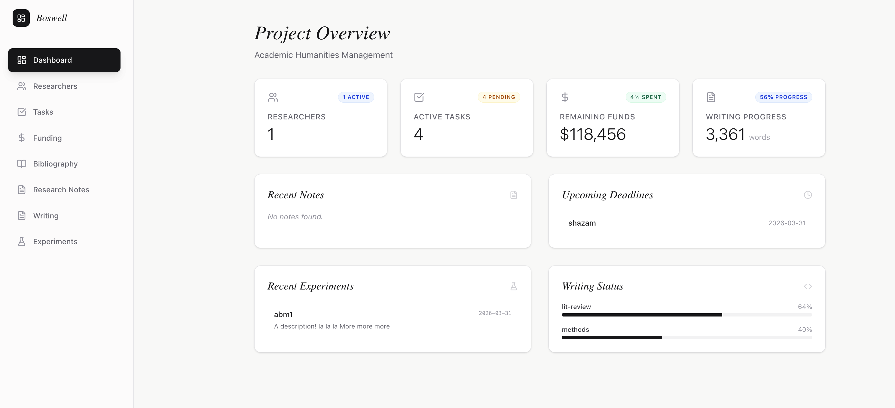

# Boswell

Why Boswell? Well, mostly because he shadowed Johnson and probably looked after the money too when they travelled.

## No, really, why?

It sounds great as a verb.

## So... why this?

I'm starting a new project. I'm not very good with project management. Obsidian could do all this, but this way, I'm less inclined to tinker with things and more likely to just get the damned job done.

You can point it at an obsidian folder so that you can take a look at your notes, if you want; similarly, you can point it at a folder where your writing lives, or a folder where your experiments live (I'm in DH; I do experiments. Or at least, I call them that.). The idea is you get a sense of what's going on and who is responsible for what. There is a very simple and straightforward kanban board. You can generate tasks from the 'writing' and 'experiments' tab. You can keep rudimentary track of your funds and what you've been spending them on. You can keep track of the contact details for any student assistants you might have (I'm always losing student id numbers for when I have to put them into the system.) You can keep track of whether or not you've filed the appropriate paperwork to get expenses reimbursed. Make an expense here; it'll show you how much money you have left.

Everything is saved locally, in markdown, so you can do with the data what you will. It saves automatically, so if you do open things in another application, better to save a copy somewhere else.

...and yes, I've been doing this rather than actually get started with my actual project. Boswell would understand.

1. git clone this repo.
2. `npm install`
3. `npm build` (or `npm run dev` if you want to make your own changes.)

You can then run a server in the `dist` folder eg `python -m http.server 8000` or you can load up the version I've pushed online at [https://boswellapp.netlify.app/](https://boswellapp.netlify.app/). Open in Chrome, Edge, or Opera. If you open in Firefox or Safari and select 'start new project' it will show you a demo mode of what the inside looks like.

Feel free to do whatever you want with this. I won't be monitoring for any pull requests. 

Use AS IS/TEL QUEL.

## Setting Up: Project Metadata
 
When you first open Boswell, you are asked to open a folder or start a new project. Choose a folder that will live alongside your other research materials — ideally inside the same directory structure as your notes, data, and writing, or version-controlled with them. Obviously, if you select a folder that other people have access to, then more than one person can modify the data and see the project. There is no password involved because I'm assuming local computers in a lab that the appropriate people have access to.
 
The first thing to fill in is the **Project Overview** on the Dashboard. Click the pencil icon next to the project title and enter:
 
- **Project Title**: The working title. This can change.
- **Principal Investigator**: Your name, or the PI's name if this is a team project.
- **Institution**: Your department and university.
- **Description**: One or two sentences. What is this project? Write it as you would explain it to a colleague in the corridor.
- **Start and End Dates**: Even approximate dates are useful for the timeline.
- **Currency Symbol**: Change this if you are not working in dollars.
 
This is the lightest layer of metadata — the information that tells someone picking up the folder what they are looking at. It feeds into the status report export and appears at the top of the Dashboard as a persistent reminder of scope.
 
---
 
## Researchers: Tracking People and Accountability
 
The **Researchers** section is for anyone doing substantive work on the project: graduate research assistants, undergraduate coders, postdoctoral collaborators, project managers. For each person, record their name, role, institutional email, and student ID if applicable.
 
The student ID field exists because anyone who has tried to put a student assistant through institutional payroll knows that the ID is the thing you always need at the worst moment and can never find.
 
Each researcher can be assigned tasks. When you assign a task to someone, their researcher card updates to show their current workload, and the task card on the Kanban shows their name. This is not just administrative — it is a record of who was responsible for what decision, what piece of data cleaning, what experimental run. If a question arises later about a methodological choice, the task assignment tells you who to ask.
 
**Paradata note**: When assigning tasks, use the description field. "Transcribe Box 14" is metadata. "Transcribe Box 14 — prioritise letters with more than two addressees for the network analysis; leave undated items in the 'needs review' folder" is paradata. The instructions encode the interpretive framework.
 
---
 
## Tasks: The Kanban as a Decision Record
 
The **Tasks** view is a four-column Kanban board: To Do, In Progress, Blocked, and Done. Tasks can be dragged between columns, assigned to team members, given due dates, and linked to files.
 
**Double-click any task card to open the full edit view.** From there you can:
 
- Edit the title and add a description
- Change the status
- Assign or reassign a researcher
- Attach a file from your computer
 
The **Blocked** column deserves particular attention. In standard project management, "blocked" means "can't proceed until something external happens." In humanities research, it often means something more interesting: "I cannot proceed because I have not yet resolved a methodological question," or "I am waiting on an archive to respond to an access request," or "this task depends on a decision that has not been made yet." When you mark a task blocked, write in the description *what* is blocking it. That record of dependency and uncertainty is paradata.
 
**Linking files to tasks** is useful when a task corresponds to a specific document. If you are reviewing a particular archival scan, working on a specific chapter draft, or running a script, you can attach that file to the task so it is findable from the project interface. The filename is stored persistently; the live file handle requires re-linking after reopening the app (a browser security constraint), but the name is always visible on the card.
 
**A note on granularity**: Resist the temptation to make tasks too fine-grained. A task that takes fifteen minutes is probably a sub-step, not a task. Aim for units of work that take between half a day and two weeks. The Kanban is most useful as a high-level view of where things stand, not as a to-do list for every hour of work. The Research Log (below) is the better place for that level of detail.
 
---
 
## Funding: Not Just Bookkeeping
 
The **Funding** section tracks grant sources, allocations, expenses, and report filing. Each funding source can have a deadline, which appears on the Dashboard as an upcoming event and in the Timeline view.
 
The "Report Filed" checkbox is so that you know whether or not you've filed the appropriate claims. The Dashboard banner warning about unfiled expenses is meant to be slightly uncomfortable. People depend on being reimbursed in a timely fashion.
 
The **Notes** field on each funding source is where you can record the grant's stated scope (as distinct from what you are actually doing with it), any conditions attached to expenditure, or the rationale for budget decisions. When a funder asks why you spent travel funds on a particular archive visit rather than another, the answer is in the notes.
 
---
 
## Bibliography: The `.bib` File as Connective Tissue
 
The **Bibliography** view reads from a `bibliography.bib` file in your project folder. If you use Zotero with the Better BibTeX plugin, you can configure it to auto-export your project library to this location, and Boswell will reflect changes when you reload.
 
The view supports full-text search across titles, authors, years, journals, and citation keys. Each entry has a "Cite" button that copies the BibTeX citation key to your clipboard in `@key` format, ready to paste into a Pandoc document or LaTeX manuscript. The "Zotero" button attempts to open the entry directly in the Zotero desktop application using the `zotero://select/` URL scheme.
 
If your `.bib` entries include an `annote` field, Boswell will display those annotations below the citation. This makes the bibliography a lightweight annotated reading list rather than a bare list of references — which is valuable for paradata purposes, since annotations are where you record not just what a source says but what it is doing in your argument and why you are citing it.

This feature is meant more for a glance at current working bibliographies rather than citation management (that's why they invented Zotero.)
 
---
 
## Notes: Your Obsidian Vault, Visible
 
The **Notes** view can be pointed at any folder of Markdown files — your Obsidian vault, a folder of meeting notes, a directory of field notes from an archive visit. It lists all `.md` files in that folder and renders them with full Markdown formatting.
 
Notes _are_ editable within Boswell, but this isn't the place to do heavy note-taking. You can create new notes, edit existing ones, and save them back to disk. This means Boswell can function as a lightweight secondary interface to your note-taking folder rather than requiring you to maintain a parallel system.
 
One suggested practice: keep a folder called `decisions/` in your notes directory, and create one note per significant methodological decision. Give each note a date and a brief title: `2025-03-14-why-we-excluded-undated-letters.md`. In the body, record the decision, the alternatives considered, and the reasoning. These decision notes are the most durable form of paradata, because they capture the moment of choice rather than reconstructing it later.
 
---
 
## Writing: Progress Without Pressure
 
The **Writing** section tracks writing projects by word count and status. Each project has a current word count (entered manually), a target, and a status — Drafting, Review, or Final. The progress bar on the Dashboard and within the Writing view gives a visual sense of where things stand across all projects.
 
You can link a folder to each writing project. Once linked, the folder's contents are listed as clickable file tiles; Markdown and plain text files can be previewed inline; other file types can be opened in their default application.
 
The word count is intentionally manual. Automatically counting words from files is technically possible, but the manual entry is a small act of attention, where you have to open the draft, check where you are, and record it. That habit, done weekly, is more useful than an automated count, because it creates a moment of intentional reckoning with progress.
 
**Generating a task from a writing project** creates a linked card on the Kanban board. This is useful when a piece of writing has a submission deadline: the writing project tracks the content, the task tracks the deadline and can be assigned to whoever is responsible for the final edit or submission.
 
---
 
## Experiments: The Core of DH Paradata
 
This section is for computational or methodological experiments: topic modeling runs, network analysis iterations, OCR preprocessing pipelines, entity recognition tests, database schema decisions. That is, any act of doing something to data in order to find out something about it.
 
Each experiment record has:
 
- A title and date
- A status: Planned, Running, or Completed
- A summary field (Markdown-formatted, for rich description)
- A link to a code repository
 
The summary field is where the paradata lives. A minimal, inadequate entry looks like this:
 
> Ran LDA topic model on the letters corpus. Found 12 topics.
 
A useful entry looks like this:
 
> **Corpus**: 847 letters from the collection, post-1770 only, excluding letters with fewer than 100 words after preprocessing (n=203 excluded; these are predominantly brief acknowledgements with no substantive content). Preprocessing: lowercase, punctuation removal, stopword removal using NLTK English list plus custom list of period-specific particles (thee, thou, hath, doth, etc. — see `custom_stopwords.txt`). Lemmatisation with spaCy `en_core_web_sm`.
>
> **Model**: LDA via Gensim, 12 topics (chosen after coherence scoring across k=5 to k=20; coherence peaked at k=11 and k=14 but 12 produced the most interpretively coherent results — subjective call). Alpha=auto, beta=auto, 100 passes.
>
> **Results**: Topics largely cohere around: travel logistics, commerce/trade, family relations, religious observance, political commentary (2 topics with distinct vocabularies), health, weather, estate management, social obligation/courtesy, miscellaneous short-form. The two political topics split roughly along domestic/foreign policy lines, which was not expected.
>
> **Concerns**: The 'social obligation/courtesy' topic may be an artefact of the genre conventions of letter-writing rather than a substantive theme. Need to assess whether this is meaningful or noise. Also: the exclusion of short letters may bias results toward more educated, verbose writers — worth noting as a limitation.
>
> **Next step**: Compare results with a run that includes the short letters, to test stability.
 
The difference between these two entries is the difference between a result and an argument. The second version documents the decisions that produced the finding, the alternatives considered, the uncertainties that remain, and the next question. That is paradata.
 
The code repository link is important. A written description of a computational process is useful, but the code is the actual record of what you did. Link to a specific commit hash rather than the repository root if you want to be precise about which version of the code produced which result.
 
**Generating a task from an experiment** creates a linked Kanban card, useful when an experiment is part of a scheduled workflow or when a planned experiment needs to be assigned to a team member.
 
---
 
## The Research Log: Daily Paradata
 
The **Research Log** is the newest and in some ways most important section. It is a date-keyed journal: one entry per day, each saved as a separate Markdown file in a `log/` subfolder of your project directory.
 
The log is for the kind of writing that does not belong anywhere else. Not a polished note. Not an experiment record. Not a task description. Just: what did you do today? What did you notice? What are you uncertain about? What did a source say that surprised you? What did a conversation with a colleague shift in your thinking?
 
This is the most intimate form of paradata, and the most difficult to sustain. Some suggestions:
 
**Write at the end of the day, not the beginning.** The log is a record of what happened, not a plan for what will happen. Plans go in the task board.
 
**Write in the first person and in prose.** This is not a bullet-point task list. Sentence-level writing forces a different kind of reflection than fragments.
 
**Include failures and dead ends.** The decision not to pursue a line of inquiry is as methodologically significant as the decision to pursue one. "Tried to use Named Entity Recognition to extract person mentions from the correspondence but the model performed poorly on eighteenth-century spelling variants; abandoning this approach in favour of manual coding" is valuable documentation. It tells future readers (including yourself) that this avenue was explored and why it was closed.
 
**Write when things are going well too.** There is a tendency to reach for the log when something has gone wrong and to skip it when work feels routine. But the log of a day when everything worked — when an experiment confirmed a hypothesis, when a chapter section finally clicked, when an archive visit turned up exactly what you were looking for — is as useful as the record of difficulty.
 
The log integrates with the Dashboard (recent entries are shown as cards) and the Export function (you can include the last N days of log entries in a status report).
 
---
 
## Timeline: Seeing the Shape of the Project
 
The **Timeline** view assembles all dated events from across the project: task due dates, experiment dates, funding deadlines, into a single chronological view grouped by month. Completed events are greyed out; overdue items are flagged in red; events today are highlighted.
 
Use this view as a sanity check at the beginning of the week and before any funder meeting. It answers the question "what is actually happening right now" in a way that individual module views do not.
 
The Timeline is also useful for identifying bottlenecks: if a cluster of tasks are all due in the same week, or if a funding deadline falls in the middle of a stretch of planned fieldwork, the collision is visible here in a way it might not be if you are looking at tasks and funding separately.
 
---
 
## Export: Making the Process Legible to Others
 
The **Export** view generates a status report from your project data. You select which sections to include, set a report date, and download the result as Markdown or a self-contained HTML file suitable for printing or emailing.
 
This is the function that makes Boswell's paradata agenda concrete. The standard use case is a funder progress report or a supervisor update: someone external to the daily work of the project needs to understand where things stand. The export assembles that picture from your actual data rather than asking you to reconstruct it from memory.
 
But the export function also supports the internal project progress meeting. A monthly or quarterly internal report, circulated among team members, forces a collective moment of reckoning with what has been done, what is blocked, what is underspent or overspent, and what the next period needs to accomplish. The act of generating the report often surfaces misalignments that have been glossed over in day-to-day work.
 
Include the Research Log section in exports when sharing progress with supervisors or collaborators. The log entries give texture and honesty to a report that would otherwise read as a dry list of deliverables. A supervisor reading a progress report that includes a log entry saying "spent three days trying to make the NER approach work before abandoning it — probably should have abandoned it sooner but the documentation of why it failed is useful" has a better understanding of the project than one reading "completed entity extraction phase" with no further detail.
 
---
 
## A Note on File Format and Longevity
 
Everything Boswell writes to disk is either Markdown or YAML frontmatter inside Markdown. These are plain text formats. They will be readable in fifty years without any special software. They can be version-controlled with Git, searched with `grep`, read by dozens of other applications, and archived by institutional repositories without format conversion.
 
This is a deliberate choice with methodological implications. The paradata you create in Boswell is not locked inside a proprietary database. It is part of your research archive in the most literal sense: it lives in the same filesystem as your primary sources, your processed data, and your writing. It can be included in a data management plan, deposited in a repository, or handed to the next researcher on the project.
 
The bibliography lives as a `.bib` file, the experiments as individual `.md` files in an `experiments/` subfolder, the log entries as one `.md` file per day in a `log/` subfolder. You can open any of these files directly and read or edit them without opening Boswell. The application is a convenient interface to data that exists independently of it.
